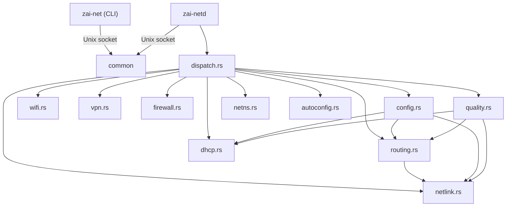

# zai-net — Architecture Guide

> **Ultra-fast, Rust-based network management for Zainium OS**  
> Version 4.0.4 LTS | Author: Ali Zain

---

## Crate Topology

```
zai-net/                     ← Cargo workspace root
├── common/                  ← Shared types & protocol framing
│   └── src/lib.rs           ← NetCommand, NetResponse, frame helpers
├── zai-net/                 ← CLI binary (no runtime deps)
│   └── src/main.rs          ← clap-based CLI → Unix socket → zai-netd
├── zai-netd/                ← Network daemon (async, privileged)
│   ├── src/main.rs          ← Entry point, socket listener, auth
│   ├── src/lib.rs           ← Module declarations
│   ├── src/dispatch.rs      ← Command router (NetCommand → handler)
│   ├── src/netlink.rs       ← rtnetlink: link enum, IP mgmt, stats
│   ├── src/routing.rs       ← IP route add/del/list via rtnetlink
│   ├── src/dhcp.rs          ← dhcpcd integration, DNS resolver
│   ├── src/config.rs        ← YAML persistence (/overlayer/syshub/etc/quantra-system/network.yaml)
│   ├── src/wifi.rs          ← wpa_supplicant/iw integration
│   ├── src/vpn.rs           ← WireGuard + OpenVPN management
│   ├── src/firewall.rs      ← nftables rule generation
│   ├── src/quality.rs       ← Bandwidth test, latency, signal quality
│   ├── src/netns.rs         ← Network namespace CRUD + veth pairs
│   ├── src/autoconfig.rs    ← Self-healing network bootstrap
│   └── src/exec.rs          ← Exec trait + MockExec for testing
└── Cargo.toml               ← Workspace definition
```

## Module Dependency Graph



## Daemon Lifecycle

```
1. main()
   ├── tracing_subscriber::init()
   ├── apply_runtime_hardening()     ← PR_SET_NO_NEW_PRIVS + PR_SET_DUMPABLE=0
   ├── new_connection()              ← rtnetlink socket
   ├── load_config_into_kernel()     ← Restore persisted state
   ├── ping_internet()               ← Connectivity probe
   │   └── auto_configure_once()     ← DHCP fallback if no internet
   ├── UnixListener::bind()          ← /run/zainium/zai-netd.sock (0o600)
   └── loop { select! { ... } }
       ├── accept → spawn(handle_client)
       ├── SIGINT → break
       └── SIGTERM → break

2. handle_client(stream, handle)
   ├── authorize_peer()              ← uid 0, daemon uid, or ALLOWED_UIDS
   ├── recv_message()                ← 4-byte LE + JSON
   ├── execute_command()             ← dispatch.rs router
   └── send_message()               ← 4-byte LE + JSON response
```

## Security Model

| Layer | Mechanism | Details |
|-------|-----------|---------|
| **Process hardening** | `PR_SET_NO_NEW_PRIVS` | Cannot gain privileges via execve |
| **Core dump prevention** | `PR_SET_DUMPABLE=0` | No memory dumps on crash |
| **Socket permissions** | `0o600` on socket + `0o700` on directory | Root-only access by default |
| **Peer authentication** | `SO_PEERCRED` via `peer_cred()` | Only uid 0, daemon uid, or `ZAI_NETD_ALLOWED_UIDS` |
| **Config file permissions** | `0o600` on `networks.yaml` | WiFi passwords/VPN keys protected |
| **VPN profiles** | `0o600` on `/overlayer/syshub/etc/quantra-system/vpn/` | Private keys never world-readable |

### Environment Variables

| Variable | Purpose |
|----------|---------|
| `ZAI_NETD_ALLOWED_UIDS` | Comma-separated extra UIDs allowed to connect |
| `RUST_LOG` | Tracing filter (default: `info`) |

## Protocol (v1)

**Transport:** Unix domain socket at `/run/zainium/zai-netd.sock`

**Framing:** `[4-byte LE u32 length][JSON payload]` (both directions)

**Request:** `NetCommand` enum (serde-tagged)  
**Response:** `NetResponse` enum (serde-tagged)

The CLI (`zai-net`) uses **blocking** `std::os::unix::net::UnixStream`.  
The daemon (`zai-netd`) uses **async** `tokio::net::UnixStream`.

## File Layout (Runtime)

```
/run/zainium/
├── zai-netd.sock              ← Control socket (0o600)
/etc/zainium/
├── networks.yaml              ← Persisted network config (0o600)
├── vpn/
│   ├── <name>.conf            ← WireGuard/OpenVPN profiles (0o600)
│   └── ...
/var/run/netns/
├── <name>                     ← Network namespace bind mounts
```

## Testing Strategy

- **common/**: Protocol serialization round-trips, frame overflow rejection
- **zai-netd/**: `MockExec` trait for external command testing
- **Testable helpers**: `parse_dns_from_content()`, `parse_destination()`,
  `parse_interface_stats()`, `is_ethernet_iface()`, `is_wifi_iface()`,
  `parse_uid_list()`, `peer_uid_is_authorized()`
- **No integration tests requiring root**: All kernel-touching code behind
  async trait boundaries

## Build

```bash
# Development
cargo check --workspace
cargo test --workspace

# Release (static musl binary)
cargo build --release --target x86_64-unknown-linux-musl

# Binaries
#   target/.../zai-net   (~2MB CLI)
#   target/.../zai-netd  (~4MB daemon)
```
