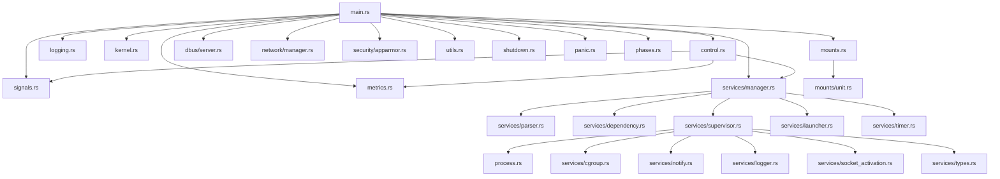

# Quantra — Architecture Reference

> **Version**: 4.0.4
> **Language**: Rust (edition 2021, MSRV 1.82)
> **Binary**: `quantra` — static PIE musl, ~1.5MB stripped

## Module Dependency Graph



## Boot Sequence (12 Phases)

```
Phase 1  ──  mounts::setup()              procfs, sysfs, devtmpfs, cgroups
Phase 2  ──  logging::setup()             stderr + /var/log/zainium/init.log
Phase 3  ──  security::apparmor::load()   load profiles from /etc/apparmor.d/
Phase 4  ──  kernel::setup()              hostname, sysctl, modules, cgroup v2
Phase 5  ──  network::configure_all()     lo up, static IP or DHCP
Phase 6  ──  signals::setup() + reaper    SA_RESTART handlers + pipe reaper
Phase 7  ──  mount_units::activate_all()  /data, /home, NFS, etc.
Phase 8  ──  services::start_all()        parallel BFS waves + cgroups + notify
Phase 9  ──  control::start()             Unix socket (std threads, no tokio)
Phase 10 ──  dbus::start()                org.freedesktop.systemd1 stub
Phase 11 ──  timer::start_all()           cron-replacement timer units
Phase 12 ──  launcher::start()            LightDM / graphical bridge
```

## Control Protocol (v1)

- **Transport**: Unix stream socket at `/run/quantra/control`
- **Auth**: `SO_PEERCRED` — only uid 0 allowed
- **Wire format**: 4-byte LE u32 length prefix + JSON payload (both directions)
- **Commands**: Start, Stop, Restart, Reload, Kill, Enable, Disable, Status, Assay, Tree, List, Metrics, Isolate, Shutdown, Signal, IsStarted, IsFailed, Setenv, AddDep, RmDep

## Service Definition (TOML)

```toml
[service]
name = "example"
command = "/usr/bin/example"
type = "daemon"                    # daemon | oneshot | bg-process
restart = "on-failure"             # always | on-failure | no
depends_on = ["network"]
after = ["syslog"]
user = "nobody"
group = "nogroup"
memory_limit = "512M"
apparmor_profile = "example"
seccomp = "profile"
no_new_privileges = true           # default: true
healthcheck.command = "/usr/bin/healthcheck"
healthcheck.interval_sec = 30
```

## Security Model

1. **Privilege Drop**: `setgroups(0)` → `setgid` → `setuid` (correct POSIX order)
2. **no_new_privs**: Default `true` for all services
3. **PR_SET_DUMPABLE**: Default `false` — no core dumps
4. **seccomp**: BPF denylist profiles applied pre-exec
5. **AppArmor**: `changeprofile` via `/proc/self/attr/exec`
6. **Capability bounding**: Per-service capability set manipulation
7. **cgroup isolation**: Per-service cgroup v2 slices

## File Layout

```
/etc/zainium/
├── init.toml              # PID 1 configuration
├── services/              # Service TOML definitions
├── enabled/               # Marker files for auto-start
├── mounts/                # Mount unit definitions
└── network/               # Network configuration

/run/quantra/
├── control                # Control socket
├── metrics                # Prometheus metrics
├── isolated               # Isolation mode marker
└── notify/<service>.sock  # sd_notify sockets

/var/log/zainium/
├── init.log               # PID 1 log
└── <service>.log          # Per-service logs (10MB rotation)

/sys/fs/cgroup/zainium/
└── <service>/             # Per-service cgroup v2 slice
```

## Dependencies (7 crates — zero async)

| Crate | Version | Purpose |
|-------|---------|---------|
| anyhow | =1.0.86 | Error handling |
| libc | =0.2.155 | Raw syscalls |
| log | =0.4.21 | Logging facade |
| nix | =0.29.0 | POSIX wrappers |
| serde | =1.0.200 | Deserialization |
| serde_json | =1.0.128 | Control protocol |
| toml | 0.8 | Config parsing |
